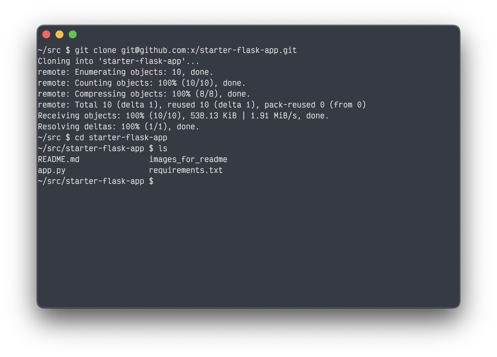
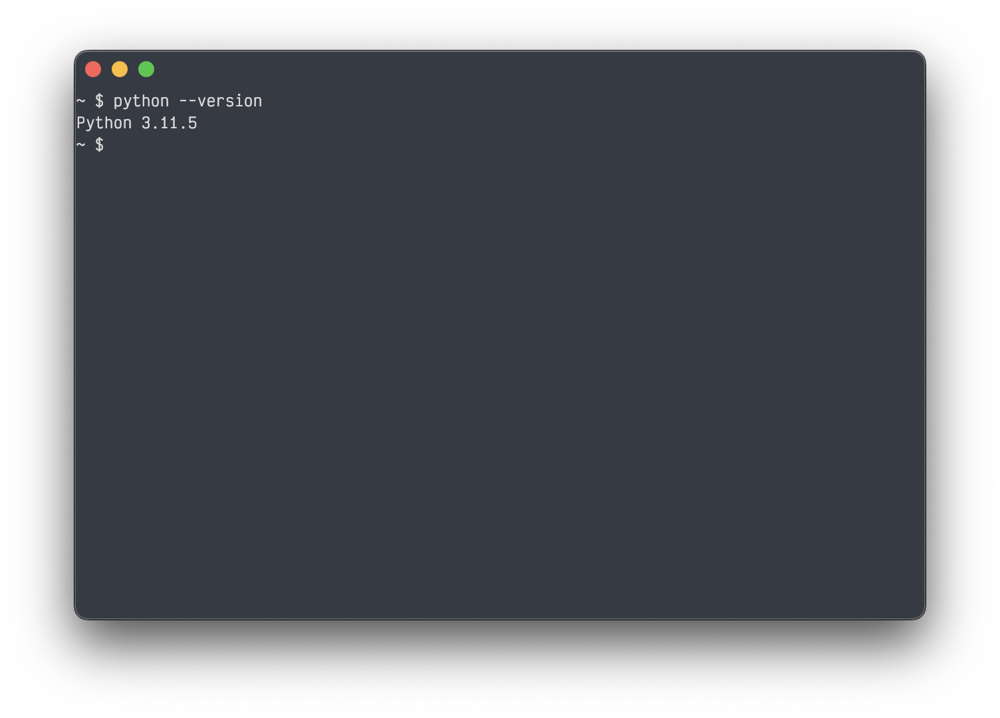
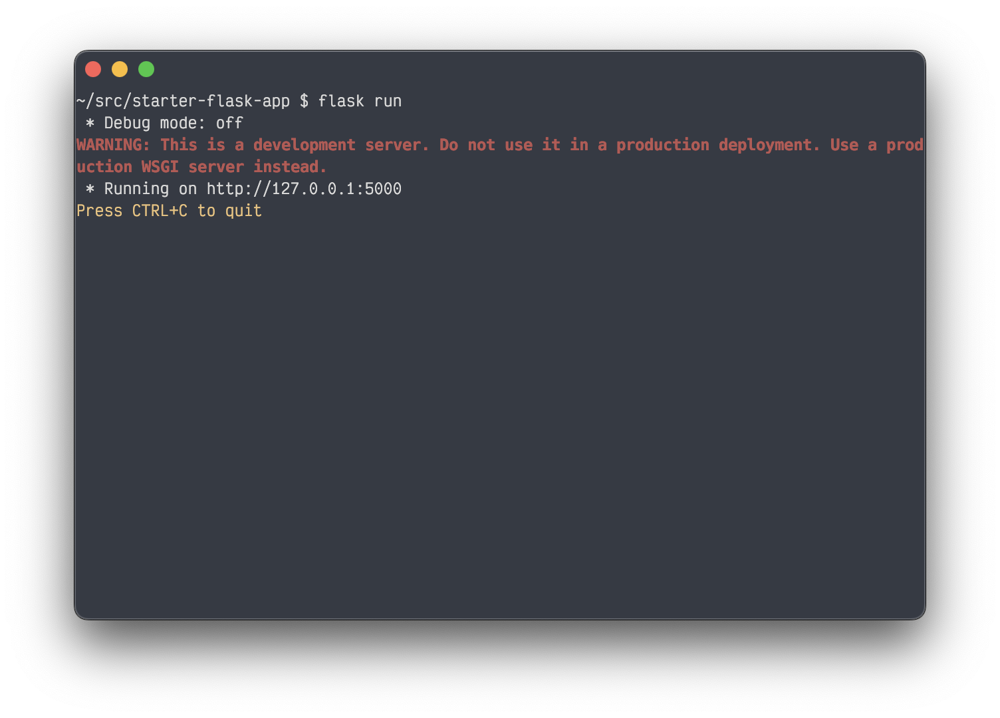
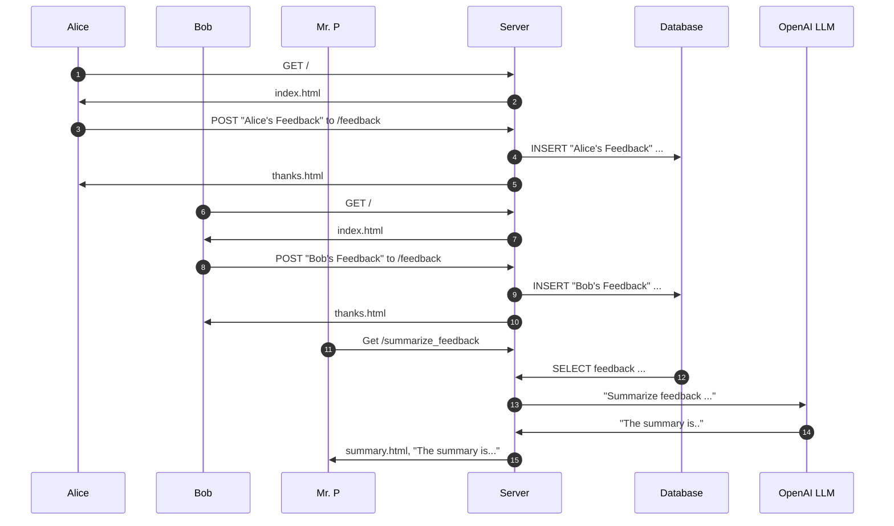

# Starter Flask App

This repo is a starter flask app for teaching purposes.

This particular variant was made to demonstrate how to use flask with the OpenAI.

For a more basic introduction, see (Starter Flask App)[https://github.com/x/starter-flask-app]

## How to Clone This Repo

1. If you haven't already, [set up git](https://docs.github.com/en/get-started/getting-started-with-git/set-up-git).
2. Click the green "Code" button in the top right corner of this page.
3. Copy the URL in the dropdown.
4. Open your terminal and navigate to the directory where you want to clone this repo.
5. Run the following command:
   ```bash
   git clone <URL>
   ```
   


## How to Run the Flask App Locally

1. If you don't already, install python and pip. If you're not sure if you have python installed, try running it locally in your command line with `python --version`.
   

2. Navigate to the directory where you cloned this repo.
3. Run the following command to install the required packages:
   ```bash
   pip install -r requirements.txt
   ```

4. Get an (OpenAI API Key)[https://openai.com/index/openai-api/] and set it to the environment variable `OPENAI_API_KEY`.
   ```bash
   OPENAI_API_KEY="sk-..."
   ```

5. Run the following command to start the flask app defined in the `app.py` file:
   ```bash
   flask run
   ```
   

6. Open your browser and navigate to [http://127.0.0.1:5000](http://127.0.0.1:5000) to see the app running locally.


## How This App Works

This app is a minimal server/client web application that template rendering, form submission, a database, and OpenAI to collect and summarize feedback from students.

It has two entry points:
- [`/`](http://127.0.0.1:5000/)
- [`/summarize_feedback`](http://127.0.0.1:5000/summarize_feedback)

Below is a sequence diagram explaining how it works with two students feedback, Alice and Bobs.



### Steps
1. Alice navigates her web browser to the root web page, this is a `GET` request to the `/` URL (the root).
2. The server returns `index.html`, a page to fill out her feedback.
3. Alice fills out the form and clicks "Submit", this forms a `POST` request with her feedback to the `/feedback` URL.
4. The server inserts Alice's feedback into the database.
5. The server returns the `thanks.html` page to Alice
6. Bob navigates his web browser to the root web page, this is a `GET` request to the `/` URL (the root).
7. The server returns `index.html`, a page to fill out his feedback.
8. Bob fills out the form and clicks "Submit", this forms a `POST` request with his feedback to the `/feedback` URL.
9. The server inserts Bob's feedback into the database.
10. The server returns the `thanks.html` page to Bob
11. Mr. P navigates his web browser to the `/summarize_feedback` URL
12. The server fetches all feedback (Alice and Bob's) from the database
13. The server uses the OpenAI client to make a request to OpenAI's LLM promt-engineering it to summarize the feedback.
14. The OpenAI LLM generates a summary and returns it to the server.
15. The Server renders the summarize.html template with the summary inside it and returns it to Mr. P
